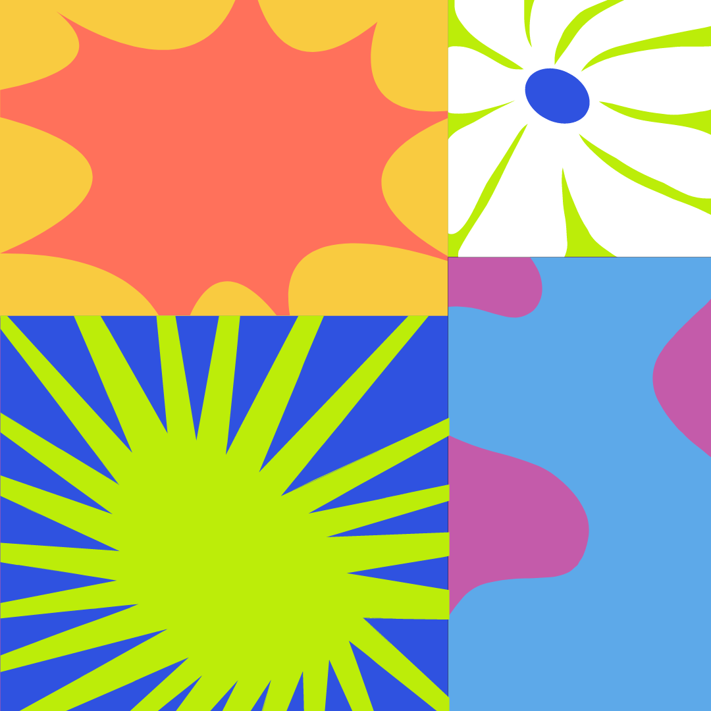
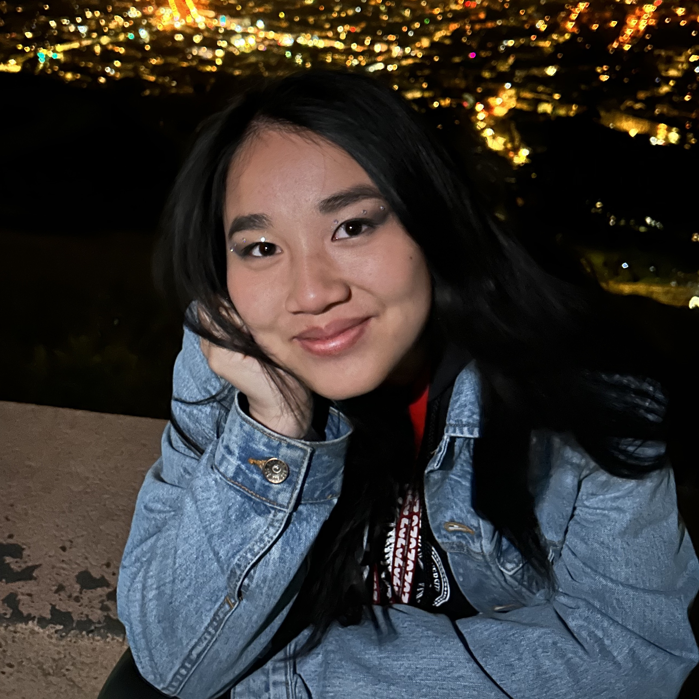
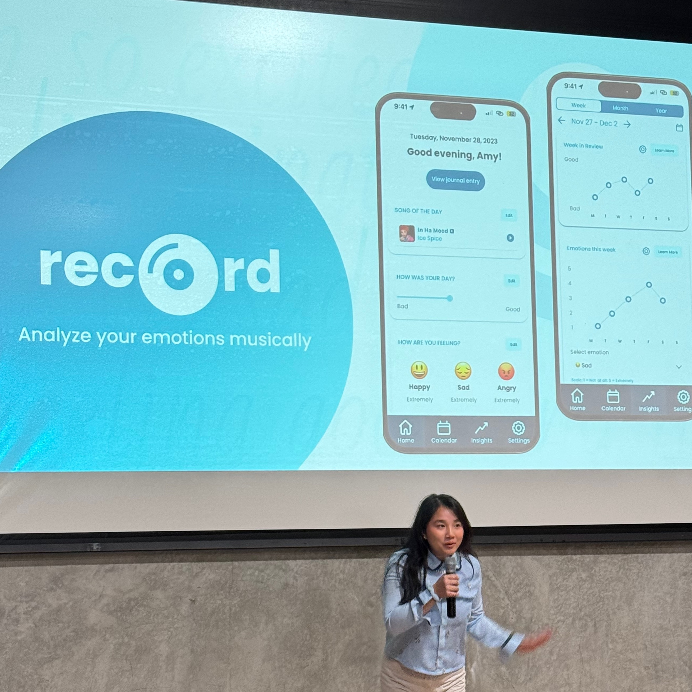

import { Alert, Flex, Heading, Container, Grid, Box } from 'theme-ui';
import Navigation from "../components/Navigation";
import Footer from "../components/Footer";
import puzzle from "../images/puzzle.gif"
import { Link } from "gatsby";
import plant from "../images/about/plant.png"
import adrenaline from "../images/about/adrenaline.png"

<Navigation/>

<Container p={6} py="3" bg="#BCED09">

# Hi, I'm Amy.

## I'm a multidisciplinary designer & developer from California. My superpowers are in speculative and multimodal design. I love dry humor, tinkering, and an ice-cold matcha latte. I'm currently pursuing a bachelor's in Psychology ('24) and a master's in Computer Science ('25) at Stanford University. This summer, I will returning as a UX Design intern @ Amazon. 

</Container>

<Grid
    columns={[1, 3]}
    gap="0"
    m="0"
>
<Box>

</Box>

<Box>

</Box>
<Box>

</Box>

</Grid>

<Container bg="blue" p="3">
<marquee behavior="scroll" scrollamount="10" direction="left"><Heading as="h1" size="3" color="white">My design philosophy: "Embrace the delightful, the playful, the novel, and the fun." </Heading></marquee>
</Container>

<Container p={6} bg="muted">

## I can't resist a good puzzle. 

### Wherever there’s an interesting problem to solve, I’ll go – whether that means deciphering complex algorithms, painting a North Star vision, or imagining end-to-end user experiences. I pull inspiration from an unconventional background in game design, neuroscience, and engineering. I know what it takes to put the pieces together. 

</Container>
<Container p={6} bg="#C45BAA">

## I'd call myself an adrenaline junkie.

### I love rollercoasters, ocean kayaking, and beating escape rooms. I'm a calculated risk taker who embraces the unknown. That's why I thrive building scrappy and building at scale. I adapt to new challenges easily and love to break out of my comfort zone. This year, I embraced new roles as a Graduate Teaching Assistant for CS377G (Designing Serious Games), CS247B (Designing for Behavior Change), and CS247G (Design for Play).

</Container>

<Container p={6} bg="#F9CB40">

## I've got a green thumb.

### I'm growing tomatoes, basil, green onions, and bok choy in my dorm room. It helps me stay patient, observant, and detail-oriented. I know good things take time. I always take a moment to read between the lines, turn research findings into actionable insights, and see the bigger picture. 

</Container>
<Footer />
