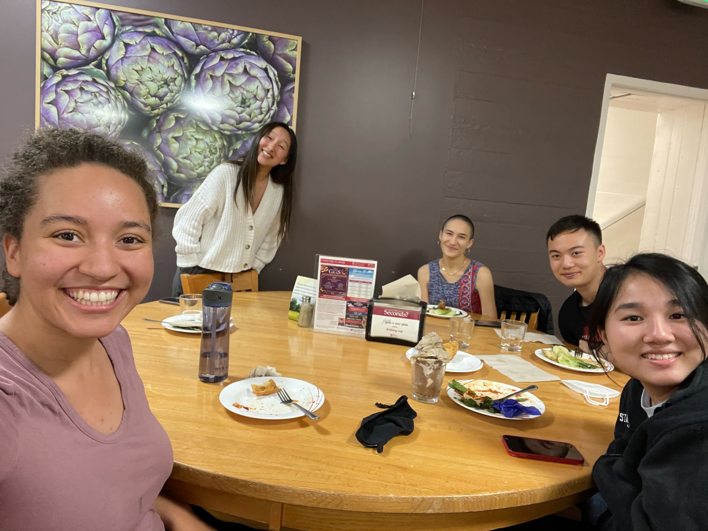

import Navigation from "../../components/Navigation";
import Footer from "../../components/Footer";
import { AspectRatio, Grid, Container, Box } from "theme-ui"

<Navigation/>

<Grid
      columns={[1, '1fr 1fr']}
      gap={4}
      py={6}
      px={4}
      sx={{
        margin: '0 auto',
      }}
    >
<Box p={4}>
# BunnyWorld
## BunnyWorld is an Android game creation tool completed as part of the CS108: Object-Oriented Programming course. The project aimed to enable users to create and play games on their smartphones seamlessly.
</Box>
<Box>
<AspectRatio ratio={16 / 9}>

<iframe src="https://drive.google.com/file/d/1OYN8IPep7VYDl1KFbidMB9kN1n0Jwc_Q/preview" width="100%" height="100%" allow="autoplay"></iframe>

</AspectRatio>
</Box>
</Grid>

<Container sx={{ p: ['2', '6'] }}  bg="muted">

### Key Features:

- Dependency on Google Gson for serialization purposes, ensuring efficient handling of game data.
- The project was set up for the Nexus 5X device with Landscape view, adhering to specific specifications.
- Implementation of game descriptions to enhance user experience and game management.
- Automatic game saving functionality to persist user progress across sessions.
- Error checks implemented for validating game and page names to ensure data integrity.
- Dynamic page titles and draft mode feature for better organization and management of games.
- Integration of various features such as shape manipulation, text editing, and image handling to enhance game customization options.
- Comprehensive error checking and handling mechanisms to ensure smooth user experience and prevent crashes.
- Possibility of adding custom scripts to shapes, with dynamic updates to accommodate changes in game elements.
- Flexibility allowing pages and shapes to have the same name, facilitating intuitive game design.

### My Role: 
I worked on adding features such as script editing and auto-checking, drawing, on-touch events, in-game possessions, and cut/copy/paste. I also designed the user interface and worked behind the scenes on the Java class design and testing

### Development Environment:
Project developed using Android Studio using Java. 
Utilized external libraries including Google Gson for JSON serialization.

### Extensions and Future Work:
- Integration of additional features such as multiplayer support, advanced scripting functionalities, and enhanced graphical capabilities.
- Exploration of optimization techniques to improve performance on a wider range of devices.
- Incorporation of community feedback and further testing to refine user experience and address any potential issues.
#### Team: Amy Lo, Jin-Hee Lee, Phil Chen, Victoria Helm, Sarah McCarthy | Duration: 3 Weeks
</Container>

<Container sx={{ p: ['2', '6'] }}  bg="white">
## Final Report
<AspectRatio ratio={16 / 9}>

<iframe src="https://drive.google.com/file/d/1rBpdMkxl_9HmDh9umPkOXtemM-dTO0Xr/preview" width="100%" height="100%" allow="autoplay"></iframe>
</AspectRatio>

</Container>

<Footer/>

