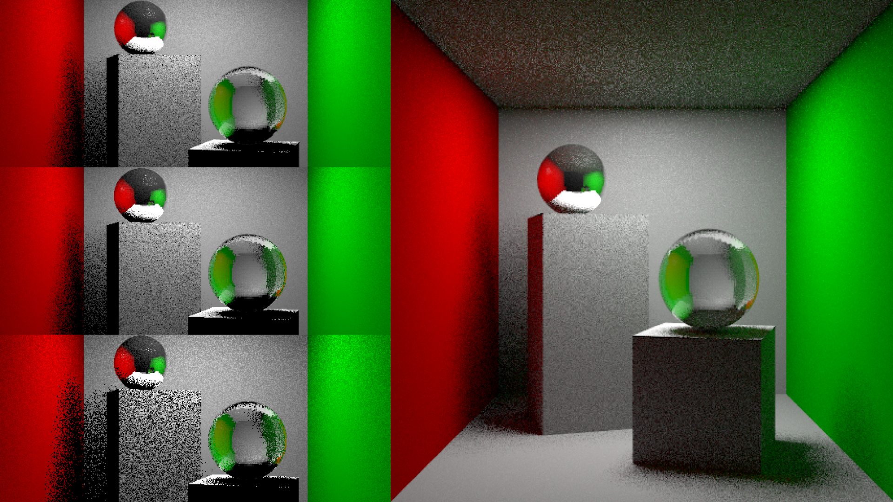

import Navigation from "../../components/Navigation";
import Footer from "../../components/Footer";

import { AspectRatio, Grid, Container, Box } from "theme-ui"

<Navigation/>

<Grid
      columns={[1, '1fr 1fr']}
      gap={4}
      py={6}
      px={4}
      sx={{
        margin: '0 auto',
      }}
    >
<Box p={4}>
# Monte-Carlo Recursive Ray Tracer
##  Extended the capabilities of the recursive ray tracer by implementing a Monte-Carlo approach for indirect diffuse lighting, specifically designed for rendering the Classic Cornell Box scene.

</Box>
<Box>
<AspectRatio ratio={16 / 9}>

<iframe width="100%" height="100%" src="https://www.youtube.com/embed/_xql_hmqZrc" title="Monte Carlo Recursive Ray Tracer" frameborder="0" allow="accelerometer; autoplay; clipboard-write; encrypted-media; gyroscope; picture-in-picture; web-share" referrerpolicy="strict-origin-when-cross-origin" allowfullscreen></iframe>
</AspectRatio>
</Box>
</Grid>

<Container sx={{ p: ['2', '6'] }}  bg="muted">

### Key Features:
- Implemented a Monte-Carlo recursive ray tracer to simulate indirect diffuse lighting.
- Utilized low-discrepancy sequencing and simple sampling techniques for more efficient coverage of areas.
- Enhanced realism by filling in gaps in the rendered image for smoother and more evenly distributed lighting.

### Tools Used:
- Blender Cycles rendering engine.
- Python

#### Team: Amy Lo, Vivian Xiao | Duration: 1 week

</Container>

<Footer/>
