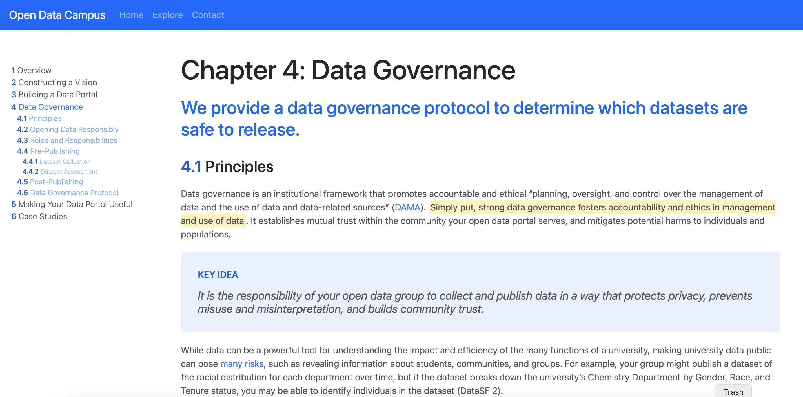
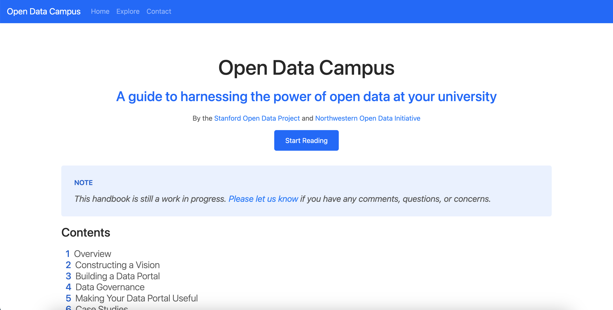

import Navigation from "../../components/Navigation";
import Footer from "../../components/Footer";
import { AspectRatio, Grid, Container, Box } from "theme-ui"

<Navigation/>

<Grid
      columns={[1, '1fr 1fr']}
      gap={4}
      py={6}
      px={4}
      sx={{
        margin: '0 auto',
      }}
    >
<Box p={4}>
# Open Data Campus
## A digital guide to harnessing the power of open data at your university by the Stanford Open Data Project and Northwestern Open Data Initiative.

</Box>
<Box>
<Box sx={{border: "0.2rem solid blue"}}ratio={16 / 9}>

</Box>
</Box>
</Grid>

<Container sx={{ p: ['2', '6'] }}  bg="muted">

### I built the Open Data Campus website for Stanford and Northwestern's open data student organizations. The website features snap scrolling for six chapters of content on harnessing open data on college campuses. This was also one of my very first web dev projects!

#### Tools Used: Bootstrap, HTML, CSS

#### Duration: 3 weeks

[GitHub](https://github.com/StanfordOpenData/open-data-handbook)

</Container>

<Footer/>
