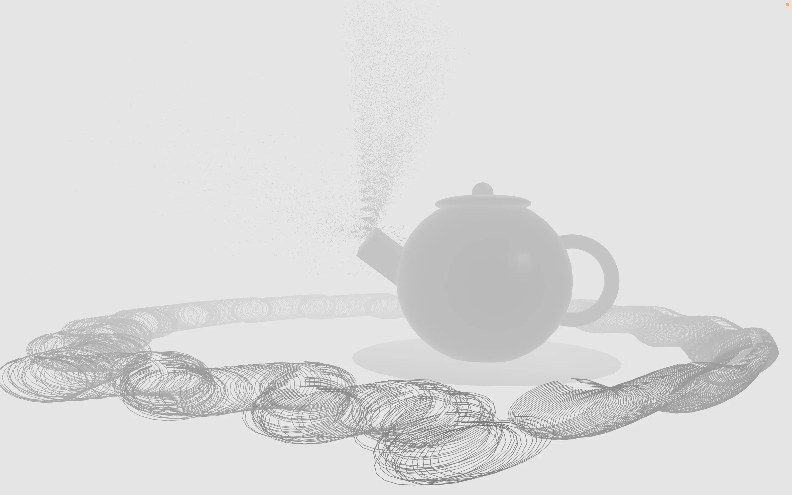
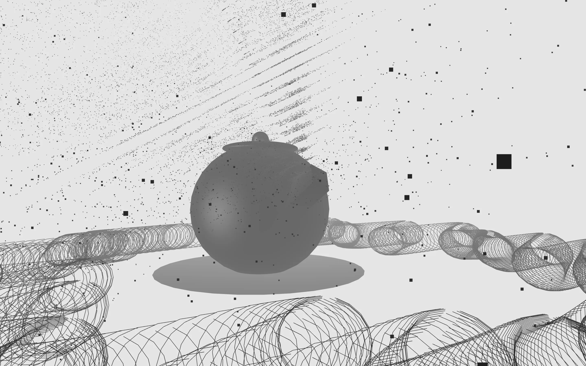

import Navigation from "../../components/Navigation";
import Footer from "../../components/Footer";

import { AspectRatio, Grid, Container, Box } from "theme-ui"

<Navigation/>

<Grid
      columns={[1, '1fr 1fr']}
      gap={4}
      py={6}
      px={4}
      sx={{
        margin: '0 auto',
      }}
    >
<Box p={4}>
# Pixel Vessel
## Real-time audiovisualizer that represents the time-domain waterform and magnitude spectrum waterfall in a chaotic zen teatime. 

</Box>
<Box>
<AspectRatio ratio={16 / 9}>

<iframe width="100%" height="100%" src="https://www.youtube.com/embed/okxL4PZTg54" title="Pixel Vessel | CS476A: Audio Visualizer (HW2) | Amy Lo" frameborder="0" allow="accelerometer; autoplay; clipboard-write; encrypted-media; gyroscope; picture-in-picture; web-share" referrerpolicy="strict-origin-when-cross-origin" allowfullscreen></iframe>
</AspectRatio>
</Box>
</Grid>

<Container sx={{ p: ['2', '6'] }}  bg="muted">

### “Pixel Vessel” is about passage of time and the fluidity of water. The teapot, which serves as the focal point, appears to be enveloped by an ever-changing, fluid-like ‘water’ created using the time-domain waterform. The magnitude spectrum waterfall is represented through the billowing steam that arises from the teapot. The teapot has been ensnared in a visual whirlpool of pixels, an unsettling portrayal that challenges conventional calm, zen representations of teatime. ‘Pixel Vessel’ brews together the orderly and the chaotic, the traditional and the digital, inviting you to meditate to the sublime.

#### Tools Used: ChuCK, ChuGL (audiovisual programming software)

#### Duration: 2 weeks

[View full documentation](https://medium.com/@amyflo/pixel-vessel-cs476a-hw-2-sound-peeking-34d537d4ea5e)

[GitHub](https://github.com/amyflo/pixel-vessel)

</Container>

<Footer/>
