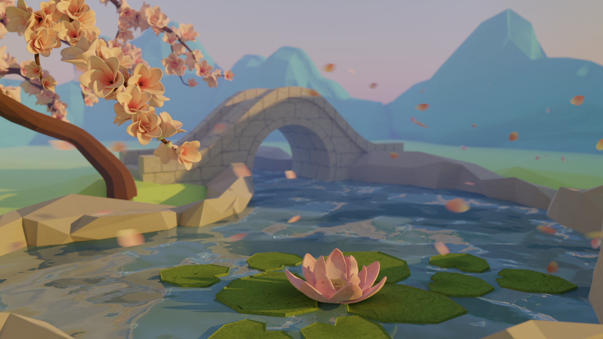
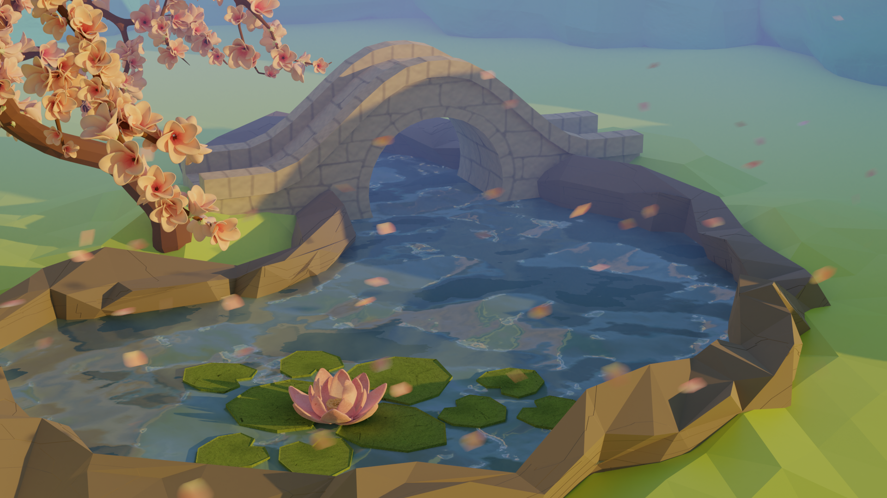
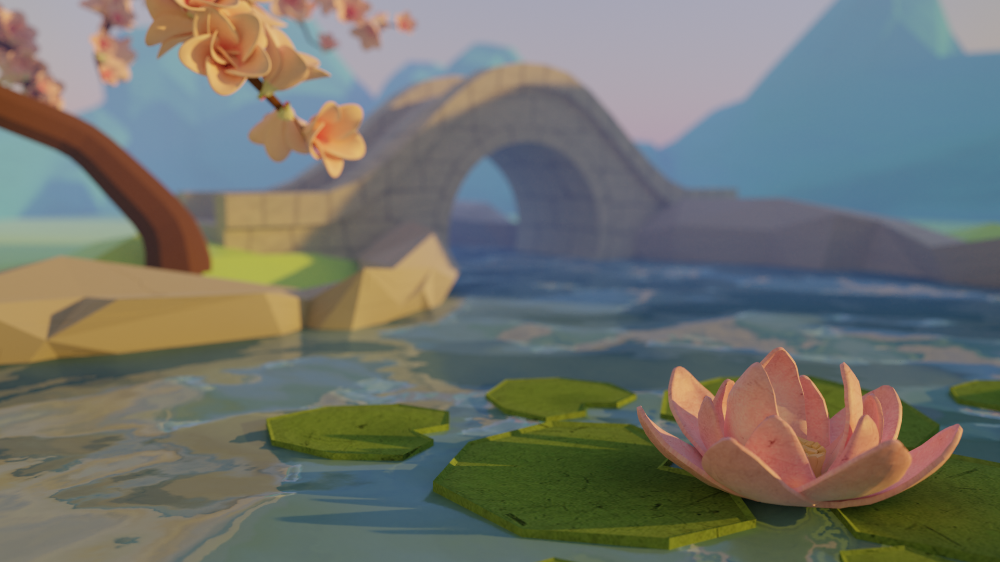

import Navigation from "../../components/Navigation";
import Footer from "../../components/Footer";

import { AspectRatio, Grid, Container, Box } from "theme-ui"

<Navigation/>

<Grid
      columns={[1, '1fr 1fr']}
      gap={4}
      py={6}
      px={4}
      sx={{
        margin: '0 auto',
      }}
    >
<Box p={4}>
# Ray-Traced Image
## For my CS 148 final project, I created a garden scene using Blender Cycles, aiming for a blend of stylized aesthetics inspired by low-poly artwork and a touch of realism.

</Box>
<Box>
<AspectRatio ratio={16 / 9}>

</AspectRatio>
</Box>
</Grid>

<Container sx={{ p: ['2', '6'] }}  bg="muted">

### Key Features:

- Stylized garden scene featuring a pond with lily pads and a cherry blossom tree.
- Utilization of Blender Cycles rendering engine to achieve desired visual effects.
- Integration of various Blender/Cycles features including volumetric emission, depth of field, motion blur, and denoising.
- Hand-crafted 3D models for assets such as trees, bridges, stones, and water surfaces.
- Custom and procedural textures created using Adobe Photoshop and Blender's built-in tools.

### My role: 
- Procedural material creation for water and stone surfaces.
- Lighting setup and sky implementation.
- Development of emitter systems for floating petals.
- Denoising and final scene refinement.

### Tools Used:
- Blender Cycles rendering engine.
- Adobe Photoshop for texture creation and editing.
- Adobe Illustrator for petal image creation.
- Various Blender modeling and texturing tools.

#### Team: Amy Lo, Vivian Xiao | Duration: 3 weeks

</Container>

<Container sx={{ p: ['2', '6'] }}  bg="white">
## Final Report
<AspectRatio ratio={16 / 9}>

<iframe src="https://drive.google.com/file/d/17RxfXISe-XNnevxg3ZnQXuyTainSMxCS/preview" width="100%" height="100%" allow="autoplay"></iframe>
</AspectRatio>

</Container>

<Footer/>