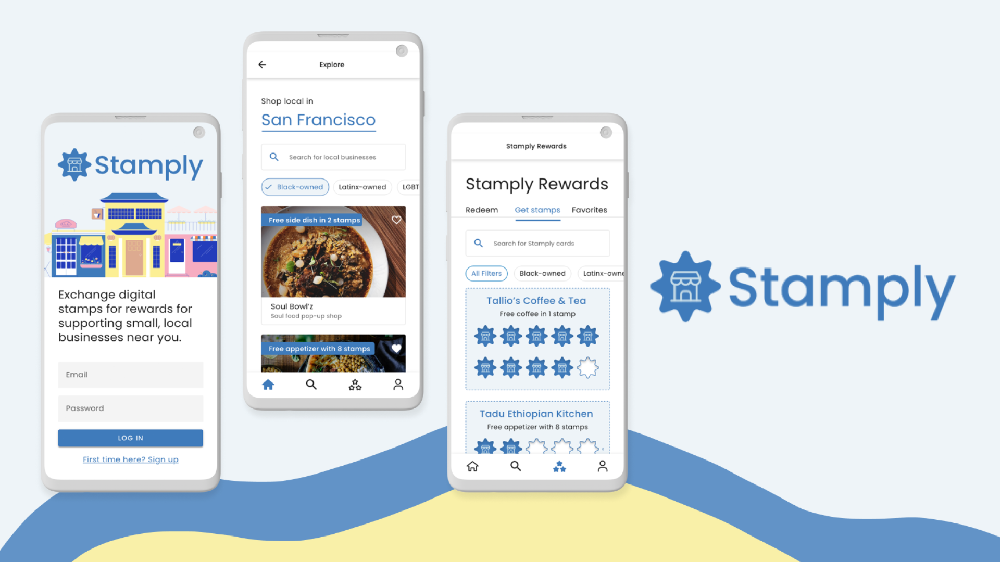
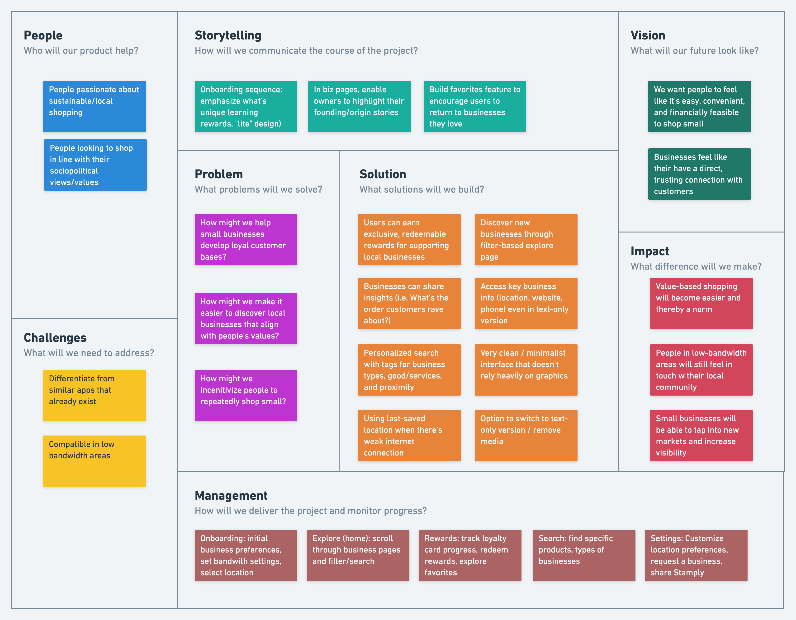
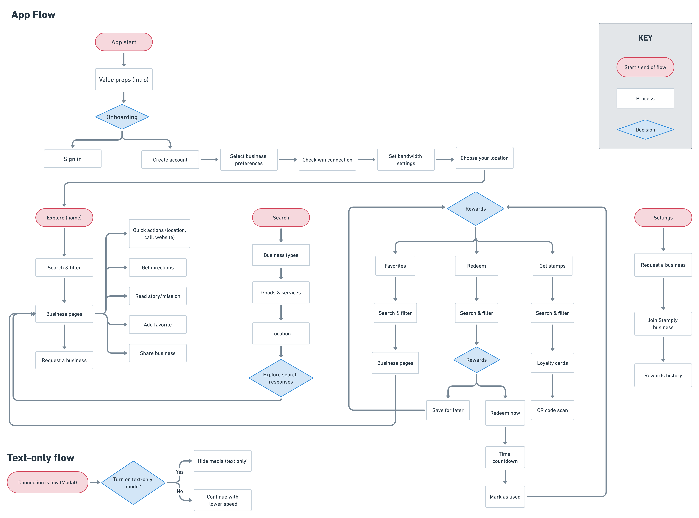
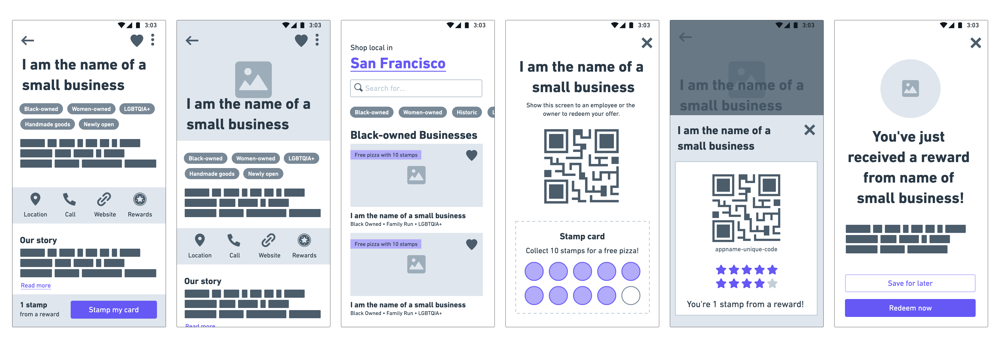
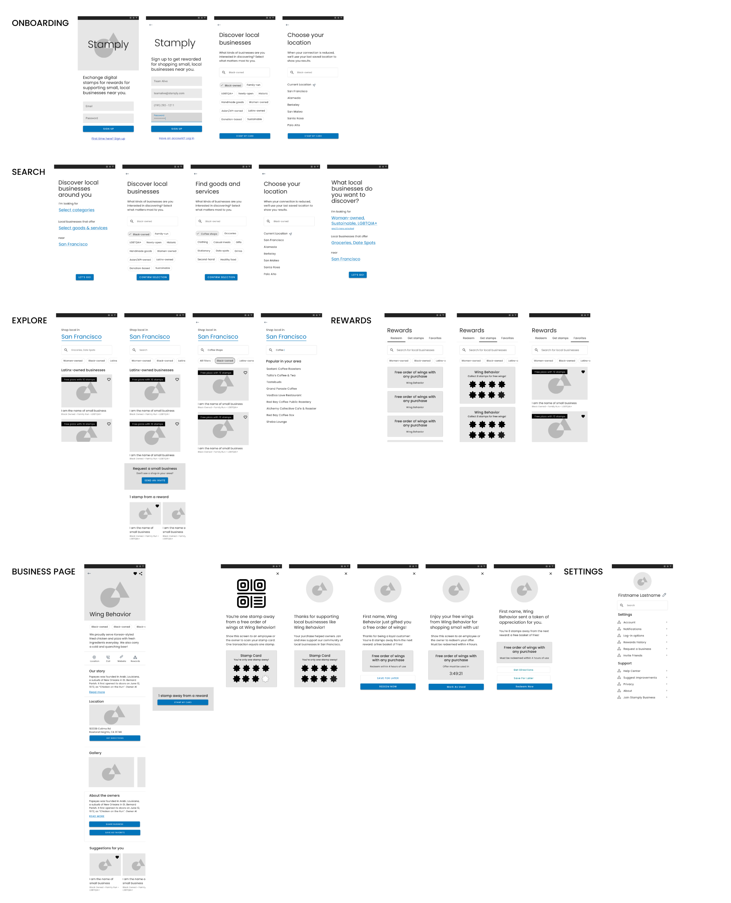
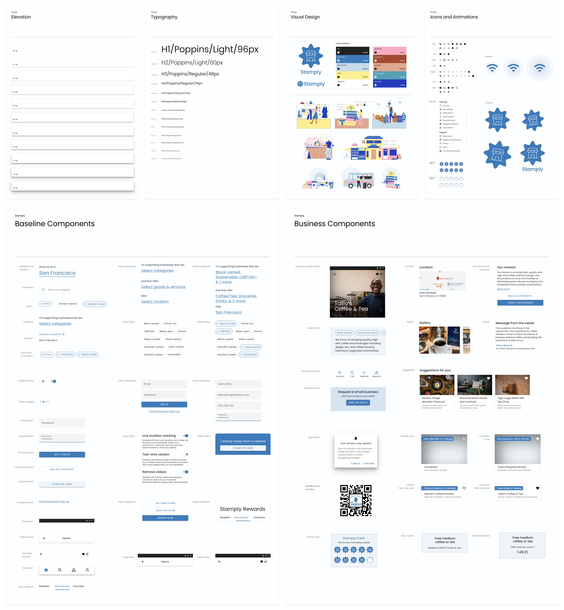
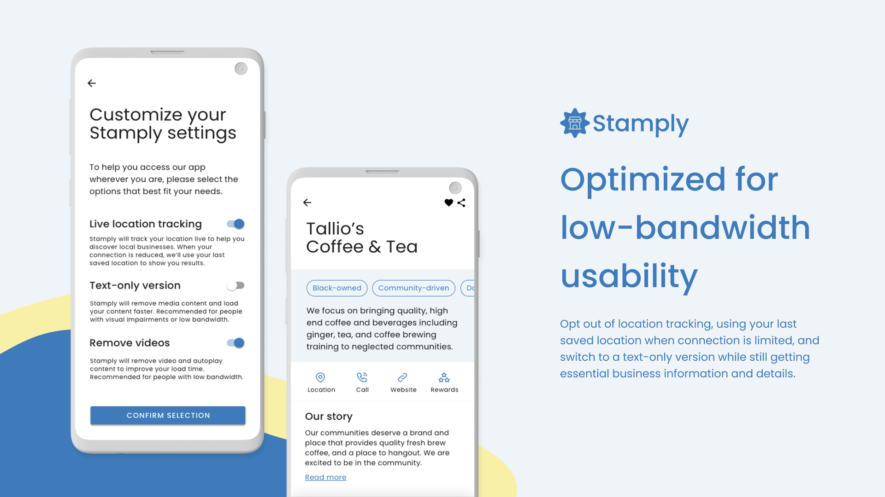
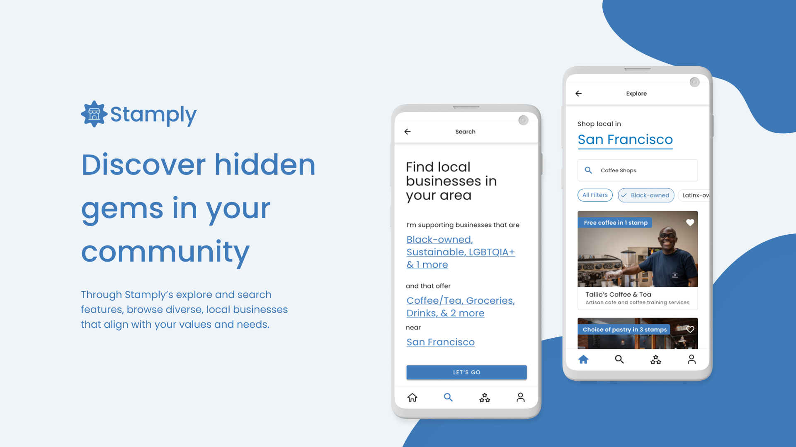
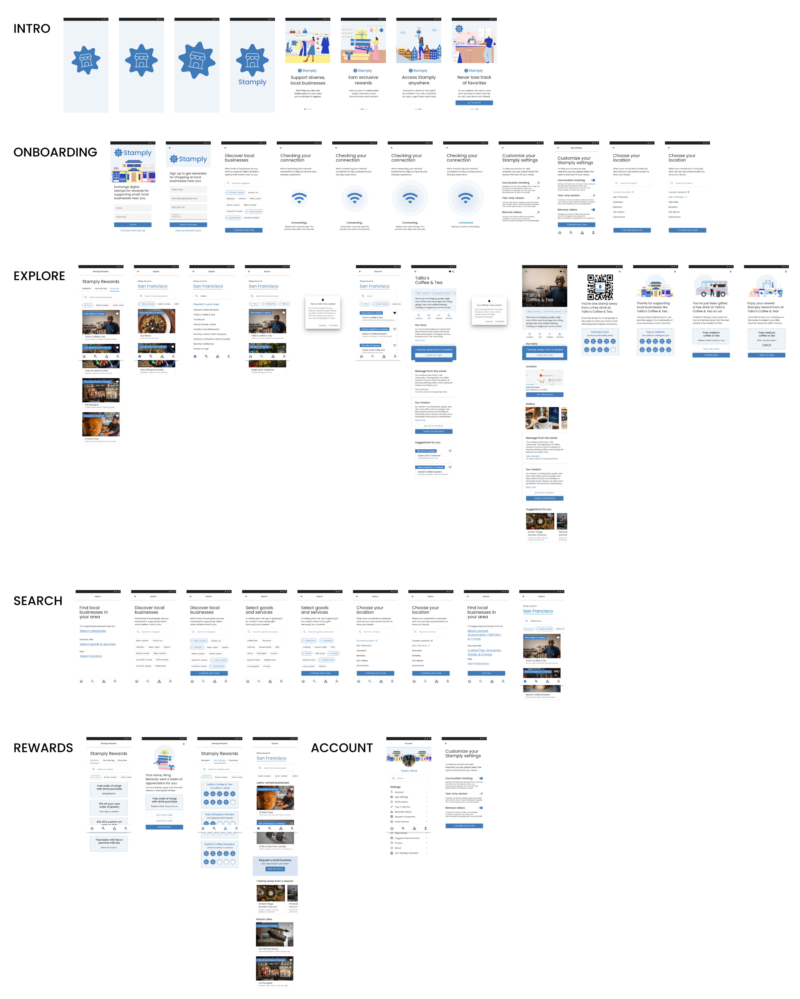
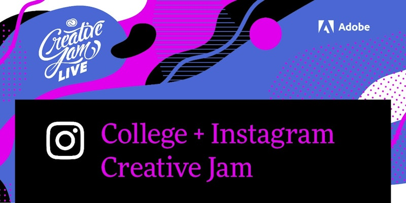

import Navigation from "../../components/Navigation";
import Footer from "../../components/Footer";
import { Alert, Container, Grid, Box } from 'theme-ui'

<Navigation/>

<Container sx={{ p: ['2', '6'] }} >
# Stamply: First-place winner of Adobe x Instagram Design Contest

<Grid
      columns={[1, '0.25fr 1fr']}
      gap={4}
      sx={{
        margin: '0 auto',
      }}
    >
<Box>
## Problem
</Box>
<Box p="3">
### On average, customers are loyal to [nine different loyalty programs](https://www.whitelabel-loyalty.com/blog/loyalty-industry-insight/the-surprising-history-of-loyalty-programs) across multiple industries. However, juggling between several different apps and rewards systems can be confusing. It’s also harder for us to be rewarded for supporting the small businesses we love who lack the infrastructure to build a loyalty program.

</Box>
</Grid>

<Grid
      columns={[1, '0.25fr 1fr']}
      gap={4}
      sx={{
        margin: '0 auto',
      }}
     
    >
<Box>
## Solution
</Box>
<Box p="3">
### Stamply is a digital loyalty app that redefines how users engage with small businesses. It rewards users for shopping at their favorite local stores, designed exclusively for Android. Stamply was awarded 1st Place in the 2021 Adobe Creative Jam x Instagram competition out of 200+ teams.
</Box>
</Grid>

</Container>

<Container sx={{ p: ['2', '6'] }} bg="muted">

## The Challenge

The challenge in this project was to create an engaging and accessible loyalty rewards app that empowers small businesses while offering users a seamless and rewarding experience. Key questions guiding the project included:

- <b>Engagement:</b> How can we create an immersive experience that keeps users engaged?
- <b>Accessibility:</b> How can we ensure accessibility, especially for users in low-bandwidth areas?
- <b>Simplicity:</b> How can we maintain simplicity while offering a feature-rich app?

</Container>

<Container sx={{ p: ['2', '6'] }}>
### Ideation

The project began with brainstorming and considering various user scenarios. We envisioned a user-centered design using the design thinking canvas, aiming to solve real-world problems. One significant constraint was designing for users with limited Internet access.

</Container>

<Container sx={{ p: ['2', '6'] }}>
### User Flow

We designed a user flow map to emphasize the discovery of small businesses in the user's area. The flow was intended to maintain simplicity while providing a rewarding experience.

</Container>

<Container sx={{ p: ['2', '6'] }}>
### Prototyping

The app’s initial design included filtering businesses by category and a scannable QR code for small businesses to digitally “stamp” your card.

</Container>

<Container sx={{ p: ['2', '6'] }}  bg="muted">
<Grid
      columns={[1, '1fr 1fr']}
      gap={4}
      sx={{
        margin: '0 auto',
      }}
    >
<Box>

<iframe
  src="https://xd.adobe.com/embed/39e41b85-775a-46f4-945d-e0009bcbd618-6cb7/"
  width="100%"
  height="600px"
  frameborder="0"
></iframe>

</Box>
<Box>
### Medium Fidelity prototype

One idea that arose out of our low-fidelity wireframes was a text-only version of Stamply to maximize accessibility of our app in low-bandwidth areas. We decided to expand on this idea in our medium-fidelity wireframes, always asking ourselves: What is the minimum we need to offer maximum impact in our design?

</Box>
</Grid>

</Container>

<Container sx={{ p: ['2', '6'] }}>

### Design System

I adapted Google's Material Design System, building custom components for our app. Prototyping on Adobe XD was new for me, and we had multiple screens with complex actions and microinteractions. We relied heavily on our user flow diagram to plan out interactions in our app and took advantage of Adobe XD’s smart-animate and timing features to create intuitive, streamlined usability 

</Container>

<Container sx={{ p: ['2', '6'] }} bg="muted">

<Grid
      columns={[1, '1fr 1fr']}
      gap={4}
      sx={{
        margin: '0 auto',
      }}
    >
<Box>

<iframe
  src="https://xd.adobe.com/embed/d4019ede-c15f-46db-98bd-b6bfe5f81b05-8152/"
  frameborder="0"
  width="100%"
  height="600px"
></iframe>
</Box>
<Box>

### High Fidelity prototype

Stamply, the digital loyalty app, emerged as the solution to these challenges. Here's how it addressed each aspect:

- <b>Engagement:</b> Stamply engages users by offering rewards, notifications, and a streamlined user experience.
- <b>Accessibility:</b> The app caters to users in low-bandwidth areas with a text-only mode and emphasizes simplicity.
- <b>Simplicity:</b> Stamply keeps the user experience simple yet feature-rich, focusing on supporting local businesses.

</Box>

</Grid>

</Container>

<Container sx={{ p: ['2', '6'] }}>
## Solution

### Solution 1: “Lite” version for low-bandwidth connectivity
Stamply is optimized for fast, accessible performance on Android, creating an accessible and inclusive experience for users with limited connection capabilities.
* Switch to a text-only version: Experience Stamply without media while still getting the information and details you need.
* Opt out of location tracking: Use your last saved location when connection is limited.
* Light, minimalist interface: We prioritize showcasing essential information and details needed to discover small businesses that matter to you.

 

### Solution 2: Explore & Search
* Through our explore page, browse local businesses from BIPOC owners and learn more about their stories.
* Flexible search feature that allows users to filter by category, goods and services, and location.

 

### Solution 3: Stamply Rewards​​​​​​​
* Earn digital stamps for shopping small that can be redeemed for rewards.
* Helps businesses build a loyal, sustainable customer base.

</Container>

<Container sx={{ p: ['2', '6'] }}>

<Grid
      columns={[1, '1fr 1fr']}
      gap={4}
      sx={{
        margin: '0 auto',
      }}
    >

    <Box>

</Box>
<Box>

##  Stamply earned the 1st Place award at the Adobe Creative Jam. 

#### Paula Guzman, Product Designer at Instagram: "I love the loyalty program aspect of Stamply. It's simple and concise."

#### Celeste Lam, Creative Director at Adobe: "Highlighting minority-owned businesses is a lovely idea. I would definitely use this app."

#### Adam Kopec, Product Designer at Instagram: "It's incredibly straightforward and intuitive to use. The focus on 'lite' is great."

</Box>

</Grid>

## Future Enhancements
### Refine the visual system to be more friendly and warm
To represent our mission of supporting local businesses, it is important that we consider how best to reflect that sense of community in the visual identity of our app. Creating this approachability while still maintaining a minimal, streamlined look would be central to next iterations.
### Expand to include customer reviews and feedback for businesses
One of the pieces of feedback we got from the judges was to incorporate features that invite users to engage with the platform (i.e. by leaving reviews and feedback) to create a sense of engagement and community.
### Build business version of the app
“Stamply Business” would allow businesses to create and tailor their profiles with photo galleries, their origin/founding stories, and customize the rewards they offer customers.
</Container>

<Footer/>