import { Alert, Container, Grid, Box } from 'theme-ui'
import Navigation from "../components/Navigation";
import Footer from "../components/Footer";

<Navigation/>
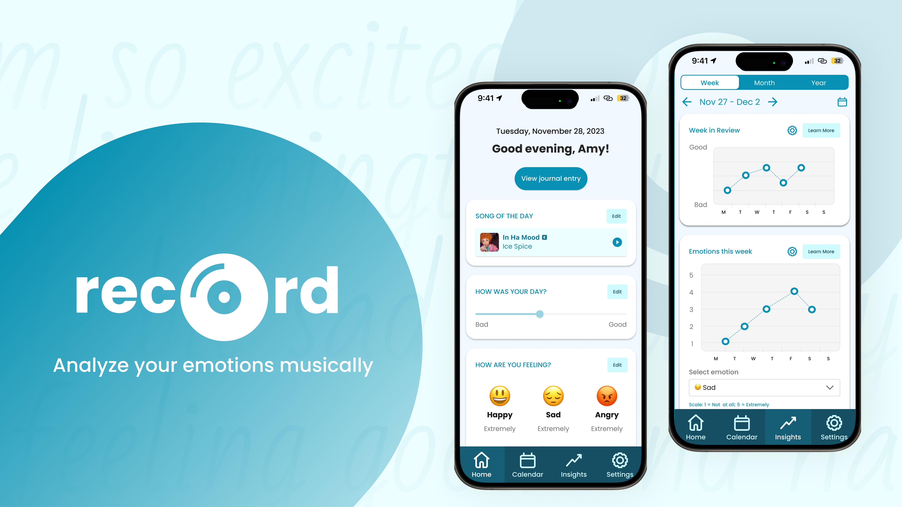

<Container sx={{ p: ['2', '6'] }} >
# Record: Analyze your emotions musically

<Grid
      columns={[1, '0.25fr 1fr']}
      gap={4}
      sx={{
        margin: '0 auto',
      }}
    >
<Box>
## Problem
</Box>
<Box p="3">
### Many people listen to music as a means of coping with their emotions – the problem is that the act of listening to music in an unstructured manner doesn’t always leave people with the emotional insights that they need.
</Box>
</Grid>

<Grid
      columns={[1, '0.25fr 1fr']}
      gap={4}
      sx={{
        margin: '0 auto',
      }}
     
    >
<Box>
## Solution
</Box>
<Box p="3">
### Record – a music-centric journaling app that shows you trends in your emotions over time. Record lets you associate your emotional states with songs, then generates insights for you based on those associations. This solution is grounded in our belief that showing people visualizations of their emotions over time in an engaging, data-driven and music-centric manner will enable them to more effectively understand / cope with their emotions. 
</Box>
</Grid>

</Container>

<Container sx={{ p: ['2', '6'] }} bg="muted">

## Needfinding

During our needfinding process, we focused on musicians. We interviewed 5 people including a professional musician, two casual musicians, a music producer/radio DJ, and an individual who played music in their childhood but stopped later.
{/* 
<Grid
      columns={[1, '1fr 1fr 1fr']}
      gap={1}
      sx={{
        margin: '0 auto',
      }}
    >
    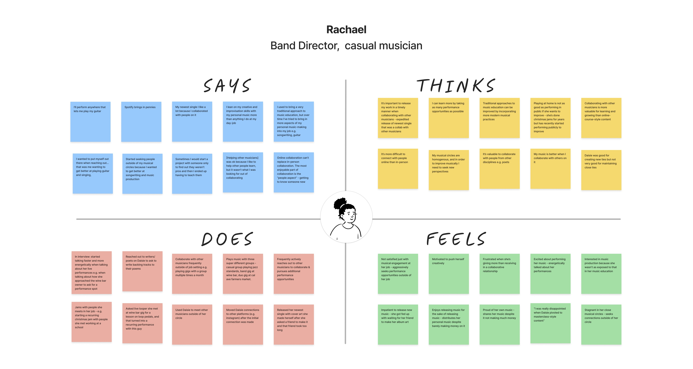
    
    
</Grid> */}

Our first step toward unpacking our needfinding interviews was to create empathy maps. We did this exercise for 3 out of our 5 interviews. After analyzing our empathy maps, we noted down interesting observations, inferences, and insights from our interviews. We focused on three insights for further exploration:

1. Music can serve as a useful tool for improving cultural understanding and appreciation.
2. Music can help in recognizing, examining, and changing emotions.
3. Musicians prefer to dedicate their time to their art, rather than engaging in mundane tasks, even if those tasks could boost their popularity.

</Container>

<Container sx={{ p: ['2', '6'] }}>

## POVs & HMWs

After conducting our initial need-finding interviews, we formulated three Points of Views (POVs). We also brainstormed "How Might We’s" (HMW) and potential solutions for each POV. In total, we came up with 98 HMWs and 80 solutions. 

### POV #1: Candice

We met Candice, a casual consumer of music and 30-year-old new mother living with her husband in Southern California. We were surprised to realize her husband shares “hispanic music” with her, and she “gets down” to it, although she doesn’t speak Spanish. We wonder if this means she connects with her husband’s culture through his music. It would be game-changing to help Candice to gain a deeper understanding of her husband’s culture despite the language barrier.

<Grid
      columns={[1, '1fr 1fr']}
      gap={4}
      sx={{
        margin: '0 auto',
      }}
    >
<Box>

#### Problem
bridge the language gap for people listening to music outside their own culture?

</Box>
<Box>

#### Solution

A product that, given any song in a different language, provides cultural context in your native language while listening.

</Box>
</Grid>

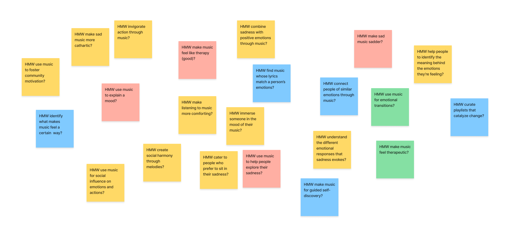

### POV #2: Connor

We met Connor, a 23-year-old recent Stanford graduate who plays the trombone and was formerly in the marching band. 
We were surprised to realize they use music to help quell feelings of anger, but are unable to use music to help quell other types of negative emotions like sadness. 
We wonder if this means there is something specific about the emotion of sadness that makes it difficult to alleviate via music. 
It would be game-changing to enable Connor to resolve emotions through music, furthering their self-discovery.

<Grid
      columns={[1, '1fr 1fr']}
      gap={4}
      sx={{
        margin: '0 auto',
      }}
    >
<Box>

#### Problem
  How might we let music be the map for emotional exploration?

</Box>
<Box>

#### Solution

A digital diary that uses natural language processing to curate music that goes along with the user’s diary entries.
</Box>

</Grid>

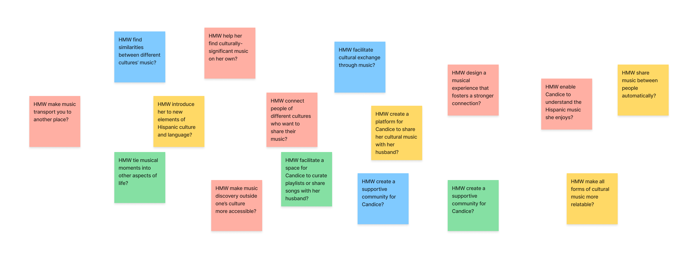

### POV #3: Elliott

We met Elliott, a professional guitarist, music Youtuber, and new dad in his mid-30’s, currently living with his wife in Amsterdam. We were surprised to realize Elliott believes aesthetically pleasing YouTube videos helps with video performance; but he refuses to spend more than 6 hours editing a video. We wonder if this means musicians want to spend their time on craft, and not on other tedious tasks (even if those tasks could increase their popularity). It would be game-changing to enable Elliott to perform tedious tasks in ways that are artistically gratifying.

<Grid
      columns={[1, '1fr 1fr']}
      gap={4}
      sx={{
        margin: '0 auto',
      }}
    >
<Box>

    #### Problem
    How might we make doing tedious tasks feel like making music?

</Box>
<Box>

    #### Solution

    A task manager that intersperses tedious tasks with breaks of creative tasks that encourage you to make music.

</Box>
    </Grid>

    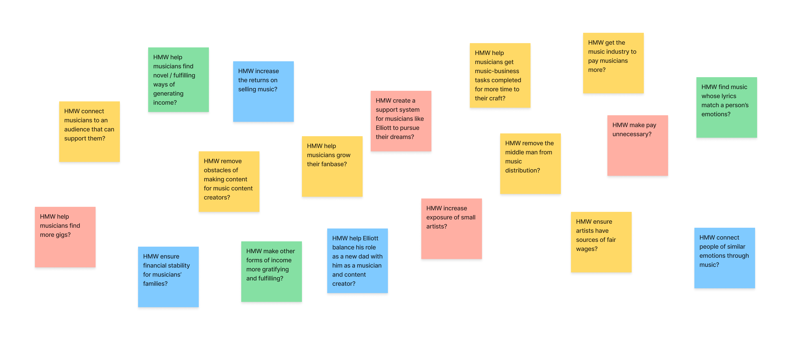
</Container>

<Container sx={{ p: ['2', '6'] }}  bg="muted">

## Experience Prototyping

These solutions formed the basis for the three experience prototypes we created to test our assumptions. 

<Grid
      columns={[1, '1fr 1.5fr']}
      gap={4}
      sx={{
        margin: '0 auto',
      }}
    >

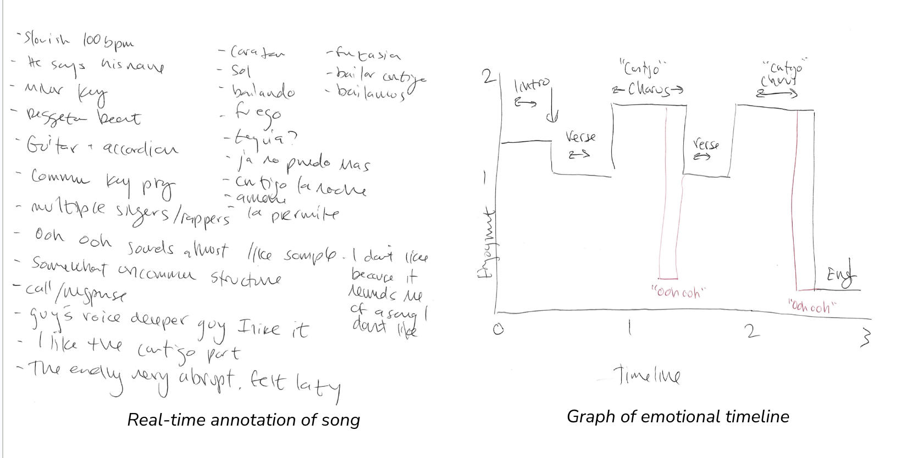
<Box>
### Solution #1: A product that, given any song in a different language, provides cultural context in your native language while listening.

Our first idea tested the assumption that listeners might be interested in the history and meaning of a song while listening to it. The prototype was focused on the Spanish song "Bailando" by Enrique Inglesias. The test included a real-time English translation of the song, plus information about the song's cultural and historical context. The participant was an English speaker with limited experience listening to Spanish music. 

The test revealed that listeners are indeed interested in learning about the cultural context of songs, even if they don't understand the language. However, the team also concluded that the prototype had too much information being presented at once, leading to a decision to focus more on the listening experience in future iterations.
</Box>

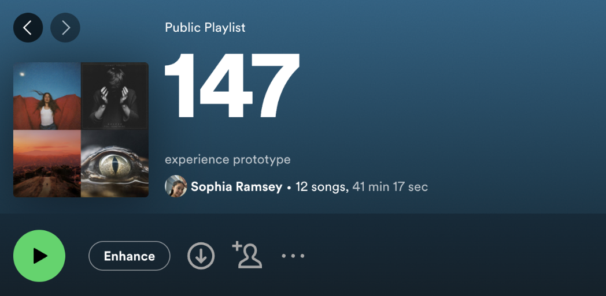

<Box>
### Solution #2: A digital diary that uses natural language processing to curate music that goes along with the user’s diary entries.

Our second idea explored the idea of providing personalized music suggestions based on the text of a user's journal entries. The hypothesis was that listeners would appreciate music tailored to their current or desired emotional state. 

The test revealed that while personalized music suggestions were appreciated, using Natural Language Processing (NLP) to select songs based on journal entries was not entirely successful. This was due to the fact that the participant primarily used the journal to vent negative emotions. 
</Box>

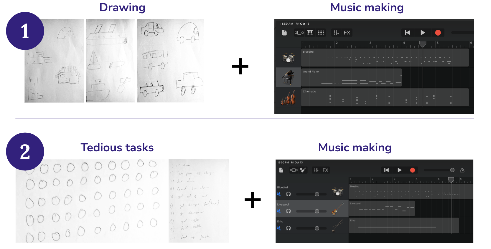

<Box>
### Solution #3: A task manager that intersperses tedious tasks with breaks of creative tasks that encourage you to make music.

Our third idea involved participants alternating between monotonous tasks and music-making tasks, and rating their engagement levels throughout. The hypothesis was that integrating musical tasks with monotonous ones would make the latter more enjoyable. 

However, the results showed that the monotonous tasks actually enhanced engagement with the music tasks. The participant reported that the breaks to do tedious tasks took pressure off of music making. They also reported that the music-making sessions felt too short, leading to a decision to try to balance the tasks and music-making sessions in future iterations.
</Box>
</Grid>
</Container>

<Container sx={{ p: ['2', '6']}}>

## Low-fidelity prototype

After evaluating our experience prototype ideas, we decided to pursue Solution #2: A digital diary that uses natural language processing to curate music that goes along with the user’s diary entries. This idea aligned with our goal of emotional exploration through music. We decided on a journaling app, but we allowed users to select their own songs to add to their entries instead of getting AI-generated recommendations based on the sentiment in their entries. 

Our initial plan was to have an iPad app, so that users could have a more traditional journaling experience using an Apple pencil to write. We planned to let users select a song and top emotions, and the majority of the experience was writing a journal entry.

<Grid
      columns={[1, '2fr 1.5fr']}
      gap={4}
      pt={4}
      sx={{
        margin: '0 auto',
      }}
    >

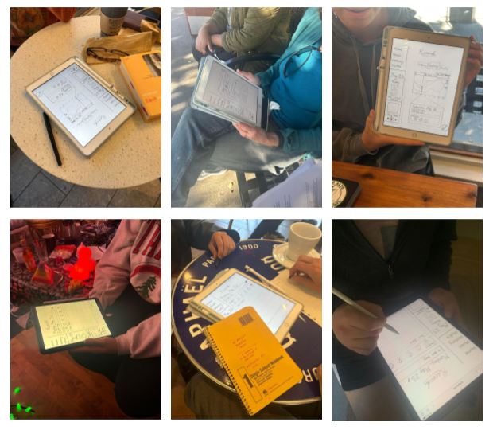

<Box>
### Usability Testing

For the usability testing of the journaling app, we recruited a diverse group of participants. Denise (68) and Bryan (35) are avid music listeners but do not journal, Elise (15) journals occasionally, Misoon (57) prefers verbal reflections daily, and Oliver (48) journals but not about his emotions. 

The testing apparatus was an iPad running the prototype on Figma. Four interviews were conducted in local coffee shops and two in private homes. The goals of these interviews were to assess the efficiency, usability, and enjoyment of the app. 

Results indicated that tasks were learnable with <mark>time-to-complete decreasing significantly for almost every participant</mark>. However, moderate and complex tasks weren't clear enough and while generally enjoyable, the act of journaling was identified as an inhibitor.
</Box>
</Grid>

</Container>
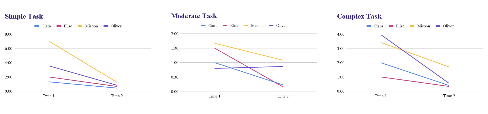

<Container sx={{ p: ['2', '6'] }}>

## Medium-fidelity prototype

Based on our usability testing feedback, we shifted our focus toward quick logs, with an optional textual entry that was more out of sight. We wanted the focus to be more on journaling than on manually selecting previous days and reflecting. 

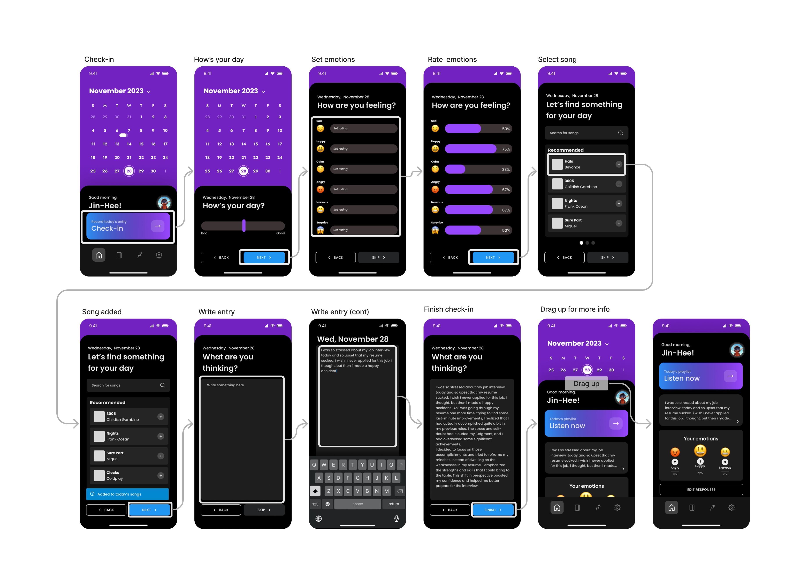

### Heuristic Evaluation

We conducted a heuristic evaluation, identified a total of 81 heuristic violations. The most common violations were H4: Consistency and Standards, and H8: Aesthetic and Minimalist Design, each with 13 instances. Our primary conclusions were that improvements are needed in our initial reading, intentionality, and interpretability. 

<Grid
      columns={[1, '2fr 1fr']}
      gap={4}
      sx={{
        padding: '4',
        margin: '0 auto',
      }}
    >

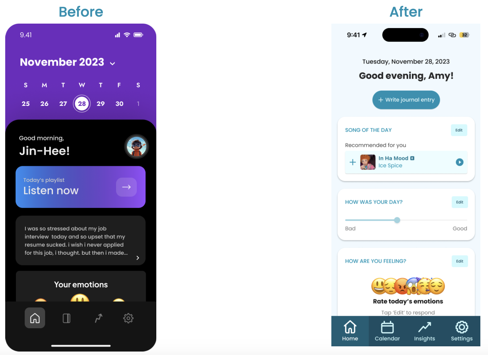

<Box>
### Usability Testing

The calendar dominated the check-in screen and used an action-indicating purple. We relocated it to a separate tab and revised the app's color usage.
</Box>

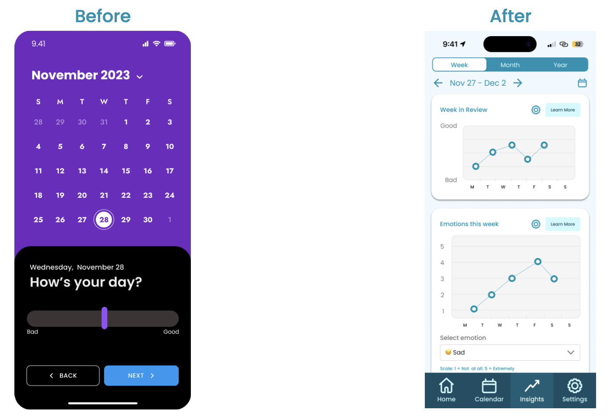

<Box>
### Color Scheme

The mix of black, grays, and bright purple was straining. We adopted a light mode with less saturated colors to promote mindfulness and limit distractions.
</Box>

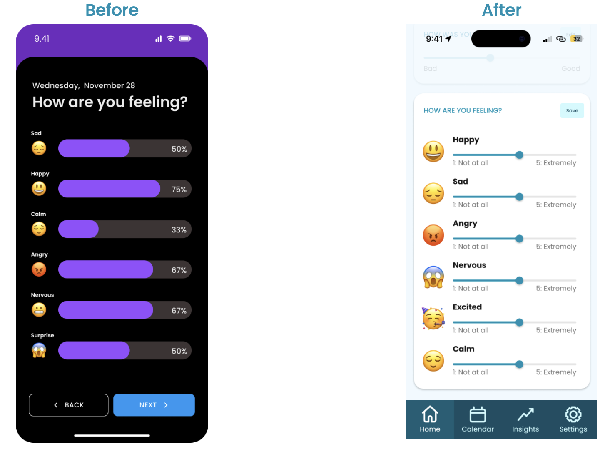

<Box>
### Data Collection

Percentages lacked context for users, specifically in emotion logging. We implemented sliders with labels and limited numerical data to graph calculations on the insights page.
</Box>
</Grid>
</Container>

<Container sx={{ p: ['2', '6'] }} bg="muted">
<Grid
      columns={[1, '1fr 1fr']}
      gap={1}
      sx={{
        margin: '0 auto',
      }}
    >
    <Box>
    <iframe width="560" height="315" src="https://www.youtube.com/embed/P7ObIa27lW4?si=viDexK3SA3kC0Cwp" title="YouTube video player" frameborder="0" allow="accelerometer; autoplay; clipboard-write; encrypted-media; gyroscope; picture-in-picture; web-share" referrerpolicy="strict-origin-when-cross-origin" allowfullscreen></iframe>
    Concept Video
    </Box>
<Box>
<iframe width="560" height="315" src="https://www.youtube.com/embed/bbIg1td6E-Y?si=JjxktZ62ekPoqTnz" title="YouTube video player" frameborder="0" allow="accelerometer; autoplay; clipboard-write; encrypted-media; gyroscope; picture-in-picture; web-share" referrerpolicy="strict-origin-when-cross-origin" allowfullscreen></iframe>
Final Demo
    </Box>
    </Grid>
    </Container>

<Container sx={{ p: ['2', '6'] }}>
## Final Solution

The medium-fi prototype forced users to complete the entire journal entry task flow consisting of several different screens, which didn’t support our goal of making journaling quick and easy. Thus, our final prototype consisted of one screen with an option to quick log today’s entry in multiple widgets, rather than one connected flow. 
After designing our app, we constructed a high-fidelity prototype using React Native and Expo.

<Grid
      columns={[1, '1.5fr 1fr']}
      gap={4}
      sx={{
        padding: '4',
        margin: '0 auto',
      }}
    >

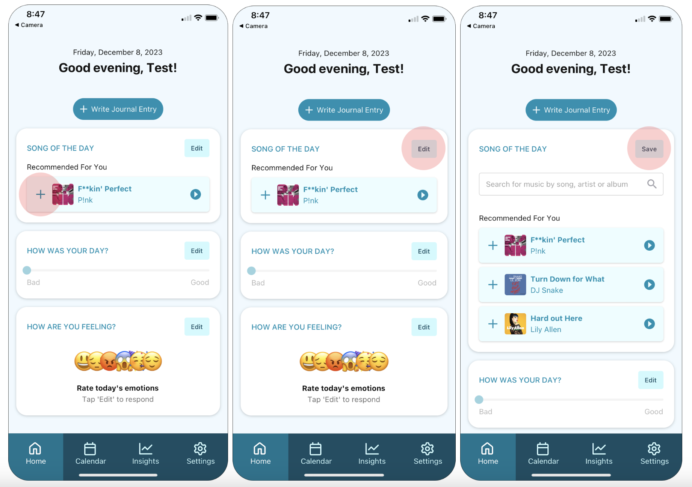

<Box>
### Record your day

This task is important because the emotional / musical insights that we provide to the user are all based upon the data that the user inputs while completing this task. We can’t provide meaningful insights to a user if they don’t consistently create recordings over time. 

There are two ways to record your song of the day. To quickly select the song that we recommended to you, press the + button on the song card. To see more recommendations or search for a song of your choice, click the Edit button on the song card. Click the Save button to collapse the song card.

You can also record your emotions and rating for the day. 
</Box>

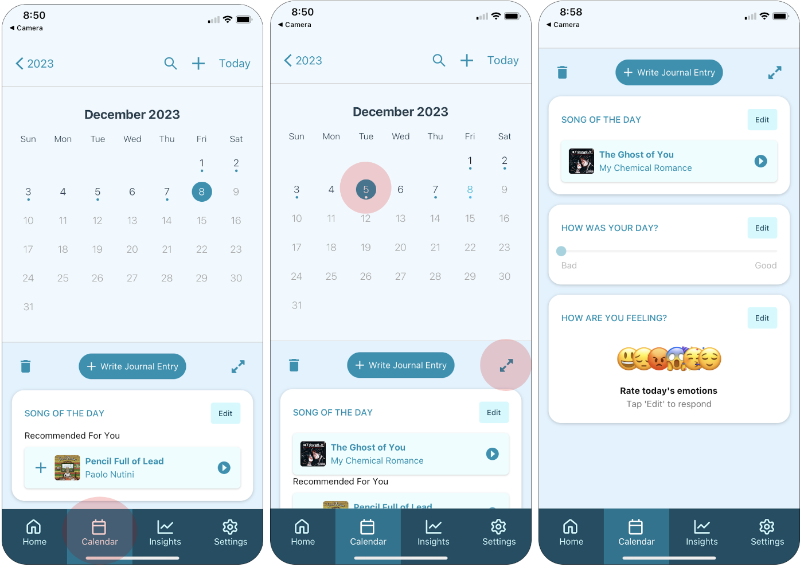

<Box>
### Review and modify a recording from a previous day.

Record is all about self-reflection, therefore it was important to us to include this feature for users who self-reflect in this way.

To review previous recordings, click the Calendar icon in the navigation bar. Select a date in the calendar to see what you recorded that day. Click the expand icon to expand your entry. Click the expand button again to collapse it back beneath the calendar.

</Box>

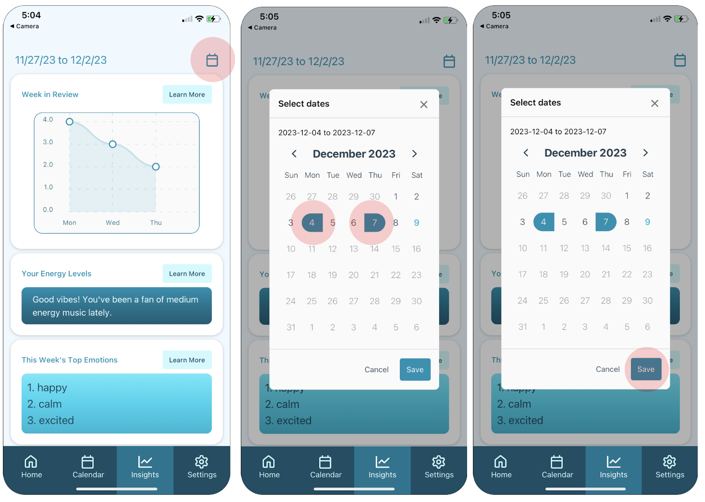

<Box>
### Interpret trends in your emotions and music over time.

To review your emotional / musical trends over time, click the Insights icon on the navigation tab. To learn more about an insight, click the Learn More button in the insight card. Scroll down the page to explore more insights. Adjust the date range for the data shown on the insights page.
</Box>
</Grid>

</Container>

<Container sx={{ p: ['2', '6'] }} bg="muted">

### Reflection

Through this project, we gained valuable insights into how customers can participate in the design process. We discovered that the features we initially considered novel and interesting may not necessarily be the most practical for implementation. For instance, our original plan was to utilize natural language processing on journal entries to suggest songs to users. However, we learned that users might write about emotions they prefer not to feel, and suggesting songs could potentially lead them into an undesired emotional state. As a result, we had to adjust some of our ideas to better cater to our intended users, which in turn allowed us to explore and concentrate on other exciting features.

### Next Steps

For enhanced security, we would ideally hash passwords and journal entry text. This would bolster user confidence in our product.

In addition, we aim to reduce loading delays experienced during navigation to the calendar and insights page due to high data volume. Despite minor improvements, such as using a flat list for each insight component, delays persist during page rendering and date switching.

<Grid
      columns={[1, '1fr 1fr']}
      gap={4}
      sx={{
        margin: '0 auto',
      }}
    >

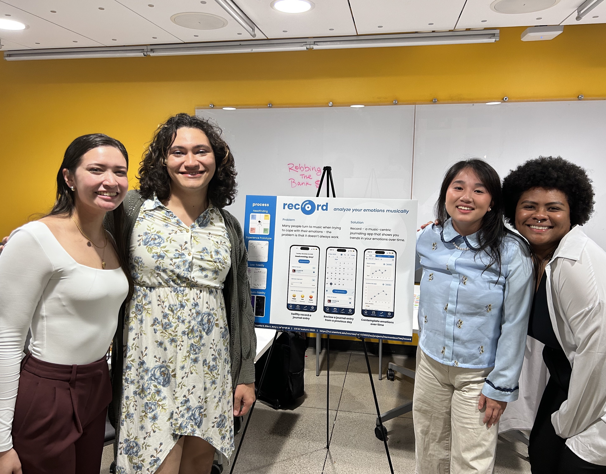

</Grid>

</Container>

<Footer/>