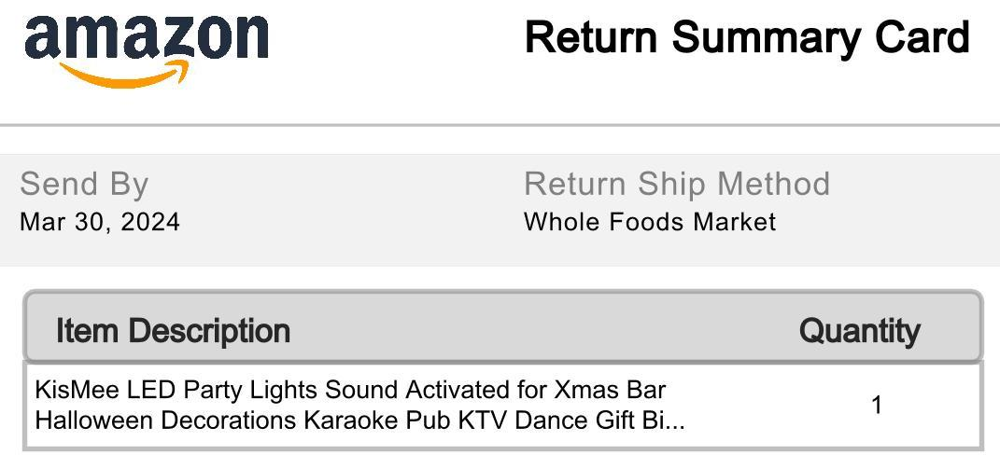

import {Grid, Avatar, Heading, Container, Box} from "theme-ui"
import { Link } from "gatsby";
import Navigation from "../components/Navigation";
import Footer from "../components/Footer";

<Navigation/>

<Container bg="muted">
<Grid
      columns={[1, '1fr 1fr 1fr']}
      gap="0"
    >
    
<Link to="/">
<Box p={4} bg="#2F52E0">

<Heading as="h2" my="4" color="white">UI/UX</Heading>
</Box>
</Link>
<Link to="/">
<Box p={4} bg="#BCED09">

<Heading as="h2" my="4">Game Design</Heading>
</Box>
</Link>
<Link to="/">
<Box p={4} bg="#F9CB40">

<Heading as="h2" my="4">Interactive Art</Heading>
</Box>
</Link>
<Link to="/">
<Box p={4} bg="#5DA9E9">

<Heading as="h2" my="4">Web Dev</Heading>
</Box>
</Link>
<Link to="/">
<Box p={4} bg="#FF715B">

<Heading as="h2" my="4">App Dev</Heading>
</Box>
</Link>
<Link to="/">
<Box p={4} bg="#C45BAA">

<Heading as="h2" my="4" color="white">Playground</Heading>
</Box>
</Link>

</Grid>
</Container>

<Footer/>