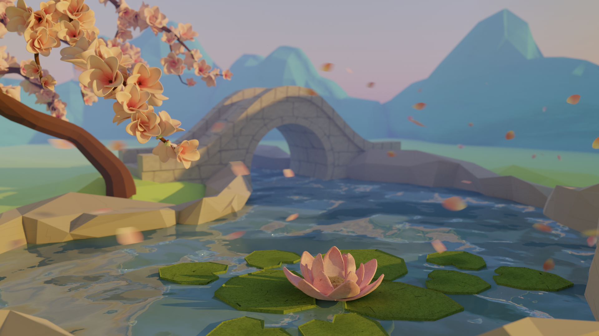

import Navigation from "../../../components/Navigation"
import Footer from "../../../components/Footer"

import { AspectRatio, Heading, Grid, Container, Box } from "theme-ui"

<Navigation/>

<Container p={6} py="3" bg="#FF715B">

# Computer Graphics

## Computer graphics is the art and science of creating visual content using computers. It encompasses techniques for generating images, animations, and immersive environments. My focus is on 3D rendering techniques. 

</Container>

<Grid
      columns={[1, 2]}
      gap={4}
      py={4}
      px={6}
      sx={{
        margin: '0 auto',
      }}
    >

<Box>
<AspectRatio ratio={16 / 9}>

</AspectRatio>
### [Recursive Ray Tracer with Blinn-Phong Model](/projects/blinn-phong)
</Box>
<AspectRatio ratio={16 / 9}>

### [Monte-Carlo Recursive Ray Tracer](/projects/monte-carlo)
</AspectRatio>
<Box>
<AspectRatio ratio={16 / 9}>

</AspectRatio>
### [Ray-Traced Image](/projects/ray-traced-image)
</Box>
</Grid>

<Footer/>
