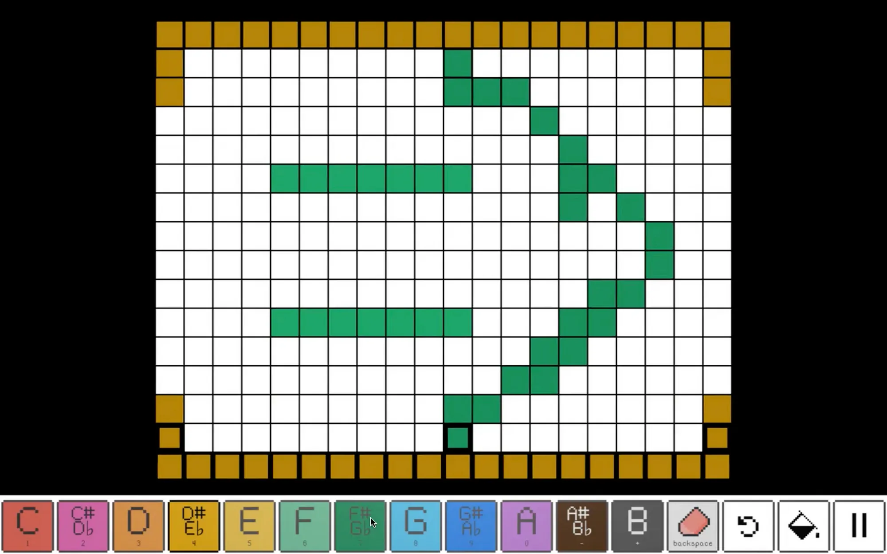
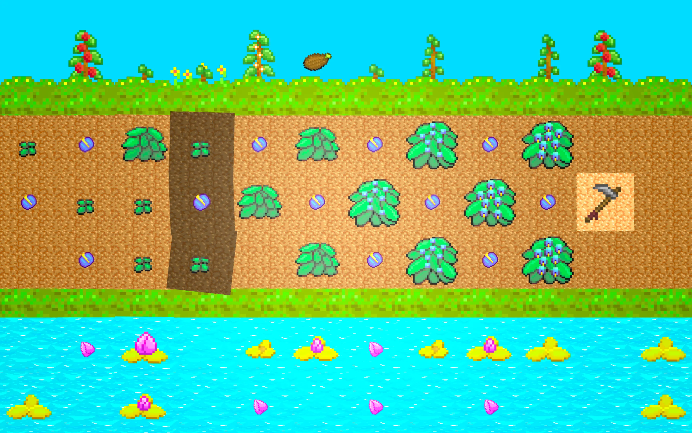
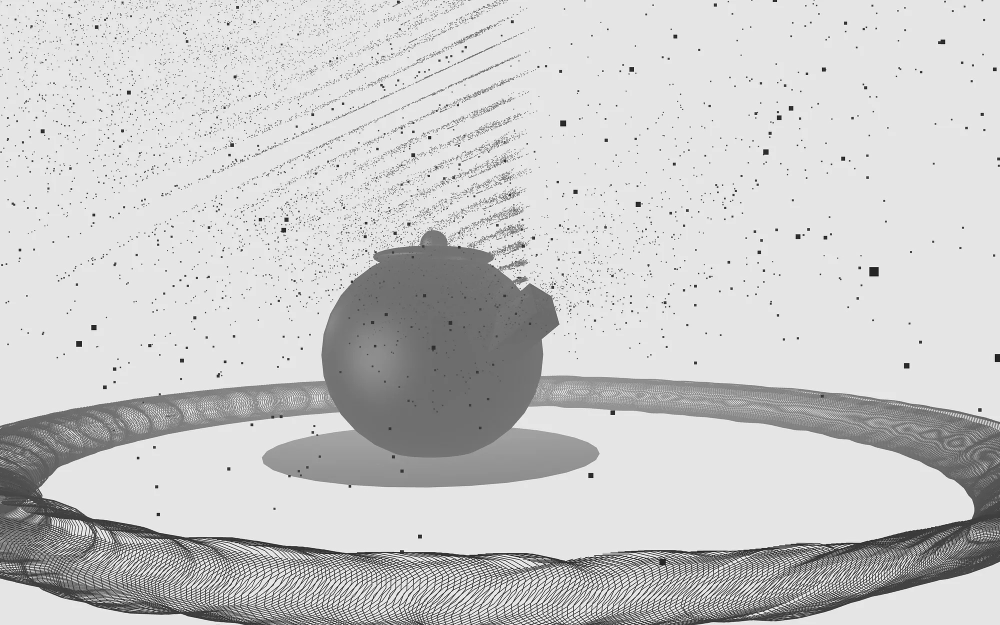
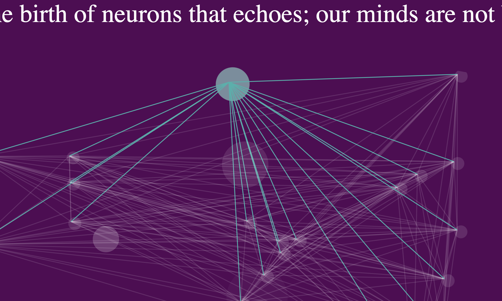

import Navigation from "../../../components/Navigation"
import Footer from "../../../components/Footer"
import { AspectRatio, Heading, Grid, Container, Box } from "theme-ui"
import { Badge } from 'theme-ui'

<Navigation/>

<Container p={6} py="3" bg="#F9CB40">

# Creative Code

## Creative coding blurs the lines between programming and art. I leverage code to generate visual or auditory experiences.

</Container>

<Grid
      columns={[1, 2]}
      gap={4}
      py={4}
      px={6}
      sx={{
        margin: '0 auto',
      }}
    >

<Box>
<AspectRatio ratio={16 / 9}>

</AspectRatio>
#### [`paint.ck`](/projects/paint-ck)
<Badge ml={1}>ChuCK</Badge>
<Badge ml={1}>ChuGL</Badge>
</Box>

<Box>
<AspectRatio ratio={16 / 9}>

</AspectRatio>
### [Groove n' Bloom](/projects/groove-n-bloom)
<Badge ml={1}>ChuCK</Badge>
<Badge ml={1}>ChuGL</Badge>

Pixel art drawing beat sequencer
</Box>

<Box>
<AspectRatio ratio={16 / 9}>

</AspectRatio>
### [Pixel Vessel](/projects/pixel-vessel)

Real-time audiovisualizer that represents the time-domain waterform and magnitude spectrum waterfall

<Badge ml={1}>ChuCK</Badge>
<Badge ml={1}>ChuGL</Badge>
</Box>
<Box>
<AspectRatio ratio={16 / 9}>

</AspectRatio>
### [Neurogenesis](/projects/neurogenesis)

Experimental digital art that imitates neuron synapses and firing as a 1-day Javascript sprint.

<Badge ml={1}>ChuCK</Badge>
<Badge ml={1}>ChuGL</Badge>
</Box>

</Grid>

<Footer/>
