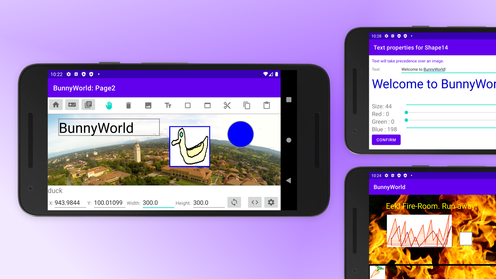
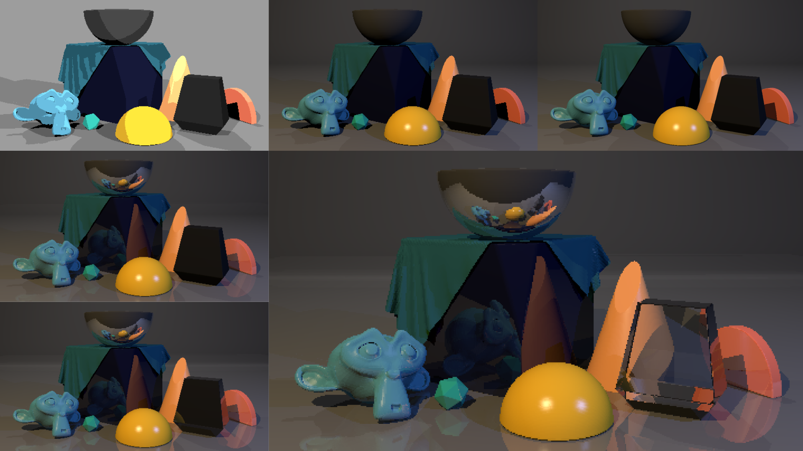

import {Grid, Badge, Box, Avatar, Text, Heading, Container} from "theme-ui"
import { Link } from "gatsby";
import Navigation from "../../components/Navigation";
import Footer from "../../components/Footer";
import puzzle from "../../images/home.png"
import { AspectRatio } from 'theme-ui'

<Navigation/>

<Container p={[3,5]} py="3" bg="blue" sx={{alignItems: "center", textAlign: "center"}}>

# <Text as="h3"color="white">Work</Text>
### <Text color="white">Selected projects across user experience design, software engineering, game design, and computer graphics.</Text>
</Container>

<Grid
      columns={[1, 2, 3]}
      gap={4}
      py={4}
      px={4}
      sx={{
        margin: '0 auto',
      }}
    >

<Box>
<Link to="/projects/bunnyworld">
<AspectRatio ratio={16 / 9}>

</AspectRatio>
</Link>
### [BunnyWorld](/projects/bunnyworld)

Android game creation tool where users can create and play games they make.

<Badge>Java</Badge>
<Badge ml={1}>Android Studio</Badge>
</Box>

<Box>
<Link to="/projects/record">
<AspectRatio ratio={16 / 9}>

</AspectRatio>
</Link>
### [Record](/projects/record)

Music-centric journaling app that shows you trends in your emotions over time.

<Badge>React Native</Badge>
<Badge ml={1}>Figma</Badge>
</Box>

<Box>
<Link to="/projects/paint-ck">
<AspectRatio ratio={16 / 9}>

</AspectRatio>
</Link>
#### [`paint.ck`](/projects/paint-ck)

Pixel art drawing beat sequencer that maps the 12-note chromatic scale to colors. 

<Badge ml={1}>ChuCK</Badge>
<Badge ml={1}>ChuGL</Badge>
</Box>

<Box>
<Link to="/projects/groove-n-bloom">
<AspectRatio ratio={16 / 9}>

</AspectRatio>
</Link>
### [Groove n' Bloom](/projects/groove-n-bloom)

Dynamic beat sequencer that models the life cycle of plants.

<Badge ml={1}>ChuCK</Badge>
<Badge ml={1}>ChuGL</Badge>
</Box>

<Box>
<Link to="/projects/pixel-vessel">
<AspectRatio ratio={16 / 9}>

</AspectRatio>
</Link>
### [Pixel Vessel](/projects/pixel-vessel)

Real-time audiovisualizer that represents the time-domain waterform and magnitude spectrum waterfall.

<Badge ml={1}>ChuCK</Badge>
<Badge ml={1}>ChuGL</Badge>
</Box>

<Box>
<Link to="/projects/neurogenesis">
<AspectRatio ratio={16 / 9}>

</AspectRatio>
</Link>
### [Neurogenesis](/projects/neurogenesis)

Experimental digital art that imitates neuron synapses and firing as a 1-day Javascript sprint.

<Badge ml={1}>JavaScript</Badge>
</Box>

<Box>
<Link to="/projects/blinn-phong">
<AspectRatio ratio={16 / 9}>

</AspectRatio>
</Link>
### [Recursive Ray Tracer with Blinn-Phong Model](/projects/blinn-phong)

Recursive ray tracer utilizing the Blinn-Phong reflection model. The project involved rendering scenes with shadow rays, ambient light, reflection, fresnel, and transmission effects.

<Badge >Blender</Badge> <Badge ml={1}>Python</Badge>
</Box>

<Box>
<Link to="/projects/monte-carlo">
<AspectRatio ratio={16 / 9}>

</AspectRatio>
</Link>

### [Monte-Carlo Recursive Ray Tracer](/projects/monte-carlo)

Extended the capabilities of the recursive ray tracer by implementing a Monte-Carlo approach for indirect diffuse lighting

<Badge >Blender</Badge> <Badge ml={1}>Python</Badge>
</Box>

<Box>
<Link to="/projects/ray-traced-image">
<AspectRatio ratio={16 / 9}>

</AspectRatio>
</Link>
### [Ray-Traced Image](/projects/ray-traced-image)

Ray-traced garden scene using Blender Cycles, aiming for a blend of stylized aesthetics inspired by low-poly artwork and a touch of realism.

<Badge>Blender</Badge>

</Box>

</Grid>

<Footer/>